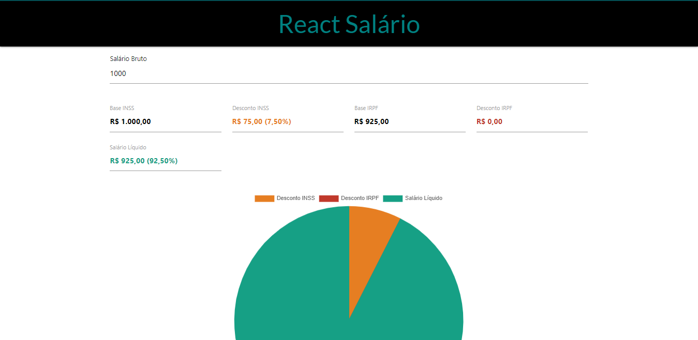

[PT-BR]

# Projeto React Salário - Módulo 3 do Bootcamp IGTI

Professor: Raphael Gomide. 
Aluno: Felipe Marques.

## :memo: Status:

- Concluído.

## :dart: Objetivo:

- Exercitar os conceitos trabalhados no módulo para a criação do front end de aplicações com React. 
- Praticar os conceitos de versionamento de código e implementação do deploy no Heroku. 

## Imagem do Projeto

## :octocat: Deploy:

[Vercel](https://react-salary-app.vercel.app/)
